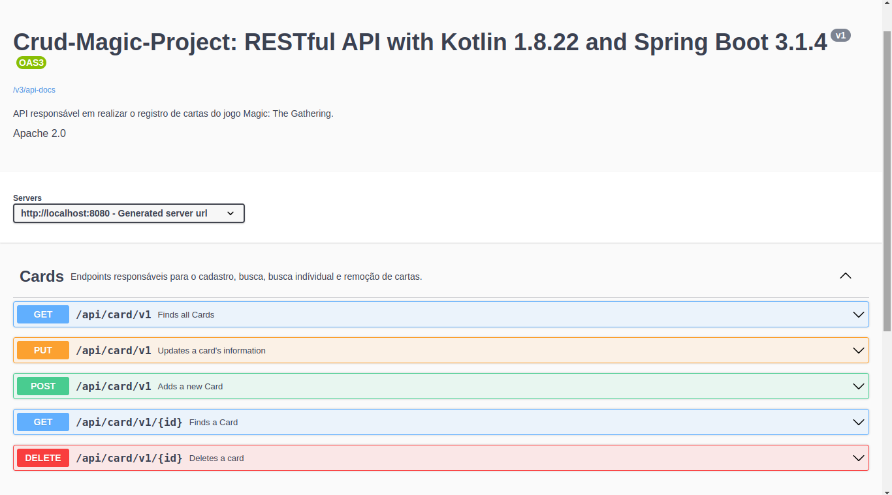

# Crud-Magic-Project
Projeto do curso de Pós Gradução da PUCPR - Desenvolvimento de Aplicativos Móveis: Webservices e MBaaS

## Descrição:
A aplicação desenvolvida atende na finalidade de fazer o cadastro de cartas do jog Magic:The Gathering.

## Motivo da aplicação:
O jogo de cartas Magic: The Gathering é bastante popular mundo a fora e possui bastante jogadores aqui no Brasil. Entretanto, os jogadores que desejam realizar o cadastro de suas carta, 
montar o seu próprio deck(Grimório) ficam apenas presos ao formato físico das cartas. A finalidade dessa aplicação,nada mais é do que realizar o cadastramento das suas cartas de Magic e 
mostrar para outros jogadores, podendo assim até mesmo realizar trocas de cartas, informações e estratégias de jogo.

## Informações Técnicas:
A aplicação foi desenvolvida com a linguagem Kotlin e Spring Boot Framework. Para a sua persistência, utilizou -se o banco de dados MySQL.

## Tecnologias usadas:
- Kotlin: https://kotlinlang.org/docs/getting-started.html
- Spring Boot Framework: https://start.spring.io/
- MySQL: https://www.mysql.com/
- Flyway Maven Plugin: https://www.baeldung.com/database-migrations-with-flyway
- Dozer: https://dozermapper.github.io/

## Instruções para usar a aplicação
### Docker MySQL
Passo 1:
- `docker run -p 3306:3306 --name=mysqldb -d mysql/mysql-server`

Passo 2:

- `docker logs mysqldb 2>&1 | grep GENERATED`

Passo 3:
- `docker exec -it mysqldb mysql -uroot -p`

Passo 4:
- `ALTER USER 'root'@'localhost' IDENTIFIED BY '12345';`

Passo 5:
- `update mysql.user set host = '%' where user='root';`

Passo 6:
- `docker container start mysqldb`

Após seguir esses 6 passos, conecte ao gerenciador de banco de dados de sua preferência.

**Atenção**:
- Ao conectar ao gerenciador(MySQL Workbech ou algum outro), crie o schema com o nome `crud_magic_project` 

### Subir a aplicação:
- Ao executar a aplicação, automaticamente as migrations serão acionadas, criando a tabela no banco de dados. Caso esteja utilizando
  **IntelliJ IDEA**, apenas acessar o arquivo **CrudMagicProjectApplication.kt** e clicar em **Run**.
  
- Para maiores informações sobre **IntelliJ IDEA**, acesse: https://www.jetbrains.com/pt-br/idea/

## Imagens:

### Próximos passos:
- Containerização da aplicação por completo da aplicação com Docker.
- Upload e download de imagens
- Integração CI/CD

### Autor:
- Alfredo Paes da Luz